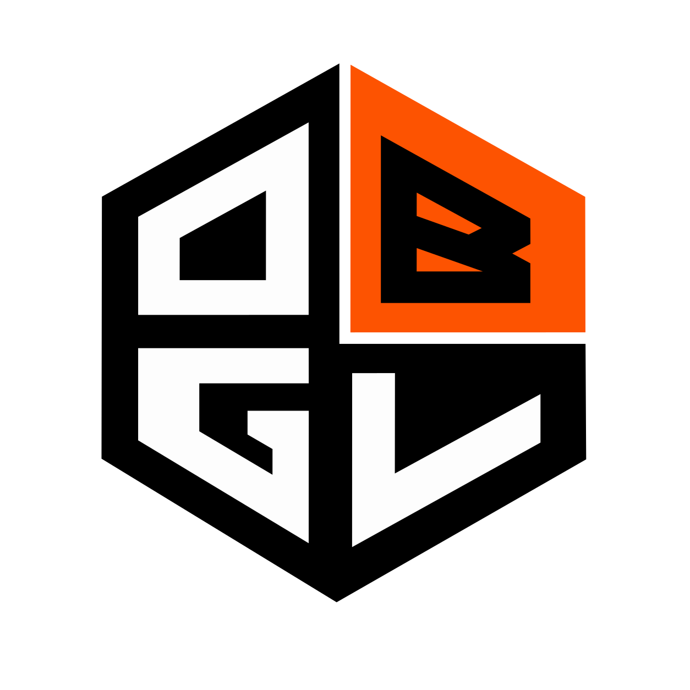
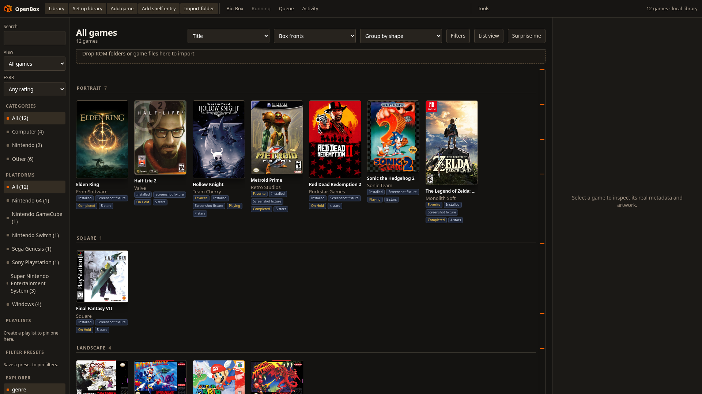
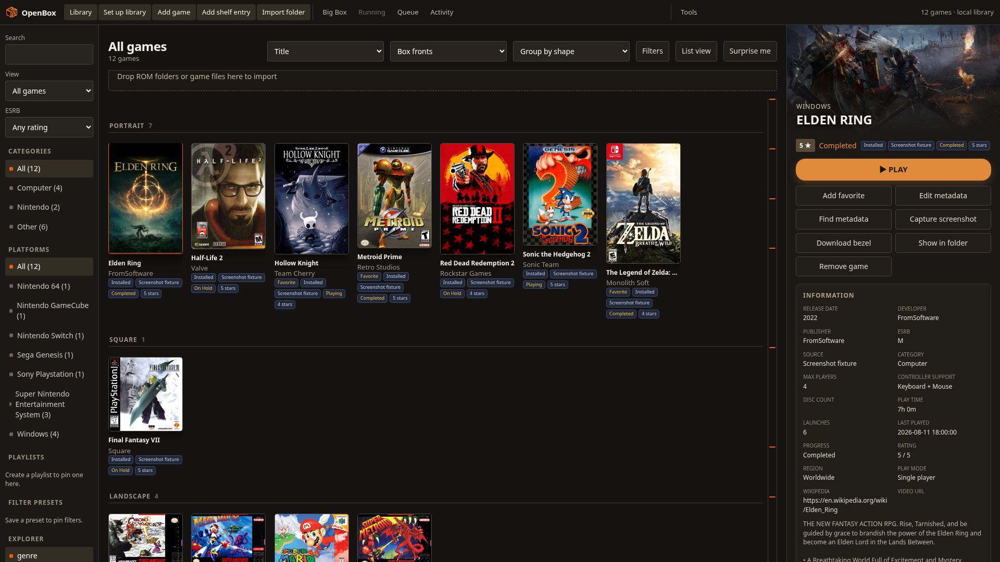

<p align="center">
  
</p>

<h1 align="center">
  <picture>
    <source media="(prefers-color-scheme: dark)" srcset="assets/openboxgl-title-dark.png">
    <source media="(prefers-color-scheme: light)" srcset="assets/openboxgl-title-light.png">
    
  </picture>
</h1>

<p align="center">
  Local-first game library and launcher for Linux
</p>

<p align="center">
  <a href="LICENSE"></a>
  <a href="https://www.python.org/downloads/"></a>
  <a href="https://github.com/vindeckyy/OpenBoxGL/releases/tag/v0.4.6"></a>
  <a href="PARITY.md"></a>
</p>

<p align="center">
  <a href="https://www.buymeacoffee.com/haydenopenbox" target="_blank" rel="noopener noreferrer">
    
  </a>
</p>

<p align="center">
  <a href="#overview">Overview</a> |
  <a href="#screenshots">Screenshots</a> |
  <a href="#why-openbox-on-linux">Why OpenBox on Linux</a> |
  <a href="#comparison-with-launchbox">Comparison</a> |
  <a href="#features">Features</a> |
  <a href="#installation">Installation</a> |
  <a href="#documentation">Documentation</a> |
  <a href="#development">Development</a> |
  <a href="#legal">Legal</a>
</p>

<p align="center">
  <a href="#screenshots">
    
  </a>
  <br>
  <sub>One library for Steam, ROMs, and emulators. Click for more screenshots.</sub>
</p>

---

## Overview

OpenBox Game Launcher is an open-source game library manager and launcher built for Linux. It puts PC games, storefront libraries, ROM collections, arcade sets, and emulator workflows in one searchable catalog with artwork, metadata, session tracking, save management, and launch profiles.

OpenBox Game Launcher is unrelated to [Openbox](https://openbox.org/), the open-source Linux window manager. The projects have different maintainers, codebases, and purposes.

If you already know LaunchBox, OpenBox Game Launcher targets the same core job on Linux: organize a large library, enrich it with metadata and media, and launch games reliably from one front end. The difference is the packaging. OpenBox Game Launcher is built for Steam, Heroic, Lutris, Flatpak emulators, RetroArch, and local ROM folders on Linux, and it does not put advanced library workflows behind a Premium subscription.

OpenBox provides two interfaces:

| Interface | Entry point | Best for |
| --- | --- | --- |
| Web UI | `python3 web_app.py` or `openbox` | Full feature set, REST API, Big Box mode |
| Native UI | `python3 openbox.py` or `openbox-native` | Lightweight desktop use |

Library data is stored locally at `~/.local/share/openbox-game-launcher/library.json`.

> **Independence notice:** OpenBox Game Launcher is an independent open-source project. It is not affiliated with LaunchBox, Unbroken Software, LLC, or the Openbox window manager project. LaunchBox and Big Box are trademarks of Unbroken Software, LLC. See [DISCLAIMER.md](DISCLAIMER.md).

---

## Why OpenBox on Linux

LaunchBox is a capable Windows library launcher with artwork, emulator profiles, and Big Box couch browsing. Several advanced library workflows require LaunchBox Premium, and there is still no native Linux build.

OpenBox is a Linux-native alternative with no subscription for custom fields, ESRB filters, list view, media packs, or similar library workflows.

OpenBox targets the launchers and paths Linux users already run: Steam, Heroic, Lutris, Gameyfin, Flatpak emulators, RetroArch, and local ROM folders.

### What that means in practice

| Topic | OpenBox on Linux | Typical LaunchBox experience on Linux |
| --- | --- | --- |
| Platform support | Native Linux application | Windows-first; Linux use often depends on compatibility layers |
| License and cost | Open source under AGPL-3.0; Premium workflows included without a subscription | Free tier plus paid Premium for several advanced workflows |
| Account requirement | No OpenBox account required | LaunchBox account and Premium features for parts of the ecosystem |
| Premium workflows | Custom fields, ESRB, list view, media packs, import wizard, and Big Box features included | Custom fields, ESRB, media packs, and several Big Box features require Premium |
| Steam integration | Reads installed Steam libraries and launches through Steam | Supported, but not centered on Linux-native install layouts |
| Heroic / Epic / GOG / Amazon | Import through Heroic manifests | Possible, but not the primary Linux workflow |
| Lutris / EA / Ubisoft / Game Pass tagging | Uses Lutris and Heroic catalog import | Less direct on Linux |
| Emulator setup | Detects local binaries and installs from Flathub with Update All | Strong on Windows; Linux emulator install paths vary more |
| Updates | GitHub releases, AppImage, zsync, Flatpak, Makefile install | Windows installer/updater focused |
| Cloud sync | Mounted-folder sync with Syncthing, Dropbox, Drive, or any path | LaunchBox Premium cloud library |
| Automation | Local REST API with token auth | Limited external automation surface |
| Handheld / couch use | Big Box mode with controller navigation and AppImage portability | Big Box exists, but Linux handheld workflows are secondary |
| Source availability | Full source code in this repository | Proprietary application |

### Who OpenBox is for

Consider OpenBox if you:

- Run Linux on a desktop, laptop, Steam Deck, or handheld PC
- Want one library for Steam, Heroic, Lutris, Gameyfin, ROMs, and standalone emulators
- Prefer local JSON library state over vendor cloud lock-in
- Need Flathub-aware emulator install/update flows
- Want RetroAchievements, save backups, session history, and Big Box in one app
- Care about open source licensing and self-hosted backups

LaunchBox remains the better choice if you:

- Use Windows as your primary launcher platform
- Need Windows-only integrations such as shell replacement, LEDBlinky, or Teknoparrot-native workflows
- Already rely on LaunchBox Premium cloud library hosting and want that exact service model

OpenBox covers the LaunchBox workflows that work on Linux and documents the rest in [PARITY.md](PARITY.md).

---

## Comparison with LaunchBox

OpenBox is an independent open-source project aimed at Linux parity with LaunchBox. The comparison below covers practical outcomes for Linux users.

### Library management

Both projects handle large local libraries, metadata editing, favorites, collections, filters, playlists, and bulk operations. OpenBox also has searchable settings, sidebar section hiding, arrange-by jump bars, provider-aware duplicate detection, ESRB filtering, custom fields, list view, platform categories, and a library health audit for missing files, media, saves, and emulator configuration.

### Imports and storefronts

OpenBox imports from:

- Installed Steam libraries across standard Steam root layouts
- Heroic for Epic, GOG, and Amazon titles
- Lutris for EA, Ubisoft, Xbox, and Game Pass tagged entries
- Gameyfin self-hosted libraries with on-demand install and uninstall
- ScummVM, RPCS3, Vita3K, Xbox 360, and loose arcade import helpers
- Local ROM folders with extension-aware scanning and drag-and-drop import
- MAME and FinalBurn DAT/XML full-set classification
- Multi-platform folder import, multi-emulator install chooser, ROM version ranking, and multi-disc M3U generation
- Storefront Manager for owned vs. installed catalog browsing and optional startup auto-import

LaunchBox covers many of the same sources on Windows. On Linux, these importers target the paths, manifests, and launchers users already have installed.

### Metadata and artwork

OpenBox syncs with the official LaunchBox Games Database, matches games locally, downloads artwork and metadata (including ESRB), supports image groups, duplicate cleanup, region priority, download limits, bulk media jobs, Steam trailer download, and Heroic GOG media download. Licensed EmuMovies and Bezel Project hooks are available when you provide your own credentials. Bundled media packs for platform logos, controller prompts, and badges are included without a subscription.

### Launching, sessions, and saves

OpenBox launches through safe tokenized emulator commands without shell interpolation, extracts archives before launch when needed, tracks sessions with play counts and play time, shows startup/shutdown overlays, supports force-close on exit, and can back up saves on session close with retention limits and guarded restore. Optional Ludusavi and Hoard CLI hooks are available from the game detail pane when those tools are on PATH.

RetroAchievements support includes account login, ROM hash matching for ZIP and 7z archives, badge display, hardcore status, beaten/mastered stats, Big Box filters, pause-menu access, and emulator launch injection.

### Big Box and themes

OpenBox includes fullscreen Big Box mode with Stage, Hybrid, and CoverFlow layouts, jewel-case styling, hybrid scoped search, filter/sort/RetroAchievements menus, configurable gamepad button mapping, bundled controller prompt packs, pause overlay for running games, attract mode and screensaver support, optional startup video, library background music, and localized UI strings (English, Spanish, German, French, Portuguese).

Themes are plain CSS files with live reload, global or per-platform assignment, and a local import workflow instead of a proprietary online theme store. Five stock themes ship with the web UI: Midnight Circuit, Phosphor Terminal, Harbor Light, Cinema Marquee, and Nordic Mist.

### Extensibility

OpenBox provides sandboxed Python plugins with `library`, `before_launch`, and `after_session` hooks, plus a bundled community plugin catalog. LaunchBox has its own plugin ecosystem on Windows; OpenBox plugins are local and inspectable.

### Parity status

The full capability matrix with acceptance checks lives in [PARITY.md](PARITY.md). Major LaunchBox workflows that apply on Linux are implemented, including Premium features without a subscription. Windows-only arcade, shell, LED, and native Xbox package features have documented Linux equivalents or external tools instead.

---

## Features

### Library and discovery

- One catalog for Steam, Heroic, Lutris, Gameyfin, ROM folders, ScummVM, RPCS3, Vita3K, and local executables
- Storefront Manager for catalog browse, uninstalled import, and startup auto-import (including Gameyfin install/uninstall)
- Installed-only and owned-library filters in desktop and Big Box views
- Game Discovery Center with recently added, never played, continue playing, highly rated, random picks, and short-session lists
- Collections, saved filter presets with explorer facets, favorites, bulk edits, custom fields, ESRB filters, list view, platform categories, and Surprise Me random selection
- Platform documents pane for manuals and reference files per platform
- MAME and FinalBurn merged/split/non-merged set classification with BIOS awareness

### Metadata, media, and playback

- LaunchBox Games Database daily sync, local matching, ESRB metadata, and artwork download
- Media manager with image groups, audits, duplicate cleanup, region priority, download limits, and bundled media packs
- Steam trailer and Heroic GOG media download from the game detail pane
- In-app PDF/document reader with page navigation, spread layout, and light/dark themes
- Multi-category video playback, screenshot capture, gallery lightbox, and library BGM in Big Box

### Emulators and launching

- Auto-detection of emulators on `$PATH`
- Flathub install, Update All, Open Emulator, dependency checks, and recommend-on-import
- YAML emulator definition packs, extension-aware ROM scanning, and per-platform command profiles with `{path}`, `{name}`, `{rom_name}`, `{app_id}`, `{heroic_app_id}`, and `{lutris_id}` tokens
- Archive extraction for ZIP plus 7z/RAR through installed `7z`
- Additional apps, alternate versions, and bundled extras per game
- Welcome wizard on first run with media limits and persistent import queues

### Sessions, progress, and saves

- Session history with timestamps, duration, exit status, optional history disable, and configurable process tracking modes
- Startup and shutdown overlays with force-close support
- Game progress automation from play time and idle days
- Save discovery for Steam Cloud, RetroArch, PCSX2, PPSSPP, RPCS3, Dolphin, and Cemu
- Versioned backups, retention limits, pre-restore safety copies, and backup-on-close

### Big Box, controller use, and couch play

- Fullscreen browsing optimized for gamepads and handhelds
- Stage, Hybrid, and CoverFlow layouts with hybrid scoped search
- Filter, sort, and RetroAchievements menus
- Configurable gamepad button mapping and bundled controller prompt packs
- Pause overlay for running games
- Attract mode, screensaver with controller wake and launch, and optional startup video
- UI localization for English, Spanish, German, French, and Portuguese

### Premium workflows (included)

LaunchBox Premium workflows are included in OpenBox without a subscription:

- Custom fields with per-game values and bulk edit support
- ESRB ratings from database imports, sidebar filtering, and list columns
- Drag-and-drop import with multi-emulator install chooser and ROM version ranking
- Bundled media packs for platform logos, controller prompts, and status badges
- Big Box shutdown commands when entering or leaving fullscreen mode

### Integrations and sync

- RetroAchievements matching, badges, hardcore tracking, 7z ROM scanning, and launch injection
- EmuMovies and Bezel Project downloads with user-provided credentials
- OBS recording auto-attach on session close
- MAME community high score export and import
- Granular JSON library backups and restore with rotation, automatic pre-restore safety copy, and safe archive path handling
- `openbox://` deep links, keyboard launcher support, and optional IGDB metadata lookup
- Mounted-folder sync for Syncthing, Dropbox, Google Drive, or any local path
- Plugin hooks and bundled plugin catalog
- Local REST API for automation and third-party tooling

---

## Installation

### AppImage (recommended)

Download the latest release from [GitHub Releases](https://github.com/vindeckyy/OpenBoxGL/releases/latest).

```bash
chmod +x OpenBox-x86_64.AppImage
./OpenBox-x86_64.AppImage
```

Use `--native` to launch the Tk interface instead of the web UI.

### System install

```bash
sudo make install
openbox          # Web UI
openbox-native   # Native UI
```

### Flatpak

```bash
flatpak-builder --user --install --force-clean build-dir io.openbox.GameLauncher.yml
flatpak run io.openbox.GameLauncher
```

### From source

```bash
git clone https://github.com/vindeckyy/OpenBoxGL.git
cd OpenBox
python3 web_app.py
```

Requirements: Python 3.10 or newer on a Linux system with standard desktop tooling.

Optional local configuration can be loaded from `~/.env` or a project `.env` file. See `.env.example`. Never commit secrets.

---

## Screenshots

<p align="center">
  <strong>Library</strong>: grid and list views, platform filters, playlists, drag-and-drop import
</p>

<p align="center">
  <a href="assets/openbox-screenshot.png">
    
  </a>
</p>

<p align="center">
  <strong>Game detail</strong>: metadata, ratings, play history, hero art, and one-click launch
</p>

<p align="center">
  <a href="assets/openbox-game-detail.png">
    
  </a>
</p>

<p align="center">
  <sub>Screenshots use real LaunchBox metadata and cover art. Regenerate with <code>python3 scripts/capture_readme_screenshots.py</code> (see <code>scripts/package.json</code>).</sub>
</p>

---

## Documentation

| Document | Description |
| --- | --- |
| [PARITY.md](PARITY.md) | LaunchBox capability matrix and Linux parity decisions |
| [CHANGELOG.md](CHANGELOG.md) | Release history |
| [CONTRIBUTING.md](CONTRIBUTING.md) | Development workflow and contribution guidelines |
| [SECURITY.md](SECURITY.md) | Security reporting process |
| [CODE_OF_CONDUCT.md](CODE_OF_CONDUCT.md) | Community standards |
| [DISCLAIMER.md](DISCLAIMER.md) | Legal, third-party reference, and formal notice policy |
| [TRADEMARKS.md](TRADEMARKS.md) | Naming, branding, and third-party asset rules |

### Emulator command tokens

Configure per-platform launch commands in emulator preferences:

```ini
[SNES]
command = retroarch -L /usr/lib/libretro/snes9x_libretro.so "{path}"
```

| Token | Description |
| --- | --- |
| `{path}` | Absolute path to the game file or ROM |
| `{name}` | Game title |
| `{rom_name}` | ROM filename |
| `{app_id}` | Steam application ID |
| `{heroic_app_id}` | Heroic application ID |
| `{lutris_id}` | Lutris game identifier |

### Plugin API

Plugins live under the user plugins directory with a `plugin.json` manifest and Python entry module. Supported hooks: `library`, `before_launch`, and `after_session`. See [CONTRIBUTING.md](CONTRIBUTING.md#plugins) for details.

### REST API

The web UI exposes a local REST API authenticated with a session token. This supports automation, integrations, and third-party tools without modifying the core application. API routes are covered by the parity and integration test suite in `test_parity_api.py`.

---

## Development

### Project layout

```
OpenBox/
├── web_app.py              Web UI server and REST API
├── openbox.py              Native Tk UI
├── importers.py            Steam, Heroic, and Lutris import
├── parity_import.py        M3U, multi-platform import, emulator recommendations, ROM ranking
├── parity_premium.py       Premium workflows (custom fields, ESRB, media packs, localization)
├── parity_storefront.py    Storefront Manager catalog and uninstalled import
├── parity_gameyfin.py      Gameyfin library client, install, and uninstall
├── parity_save_tools.py    Ludusavi and Hoard CLI wrappers
├── parity_discovery.py     Game Discovery Center lists
├── parity_media.py         Media queues, duplicates, region priority, limits
├── parity_saves.py         Save retention and backup-on-close helpers
├── parity_integrations.py  RA inject, bezels, EmuMovies, OBS, MAME scores
├── stock_themes.py         Bundled stock CSS theme installer
├── themes/                 Stock Web UI themes (Midnight Circuit, Phosphor Terminal, Harbor Light, Cinema Marquee, Nordic Mist)
├── metadata.py             LaunchBox database sync and media scraping
├── emulators.py            Emulator profiles and Flathub management
├── retroachievements.py    RetroAchievements integration
├── saves.py                Save discovery and backup engine
├── updates.py              Verified GitHub release updater
├── env_config.py           Local environment and token loading
├── plugins.py              Plugin lifecycle and hooks
├── plugin_catalog.py       Bundled community plugin catalog
├── catalog.py              Search, filters, and bulk edits
└── test_*.py               Test suite
```

### Run tests

```bash
./run_all_tests.sh
```

Build the AppImage:

```bash
./build_appimage.sh
```

Pull requests should pass the full test suite. See [CONTRIBUTING.md](CONTRIBUTING.md).

---

## Legal

OpenBox Game Launcher is released under the [GNU Affero General Public License v3.0](LICENSE).

Trademark references to LaunchBox, Steam, Heroic, Lutris, RetroArch, and other third-party products are used for compatibility description only. OpenBox does not distribute ROMs, BIOS files, firmware, or DRM circumvention tools.

For the full legal policy, see [DISCLAIMER.md](DISCLAIMER.md) and [TRADEMARKS.md](TRADEMARKS.md).

---

## Support

OpenBox is free and open source (AGPL-3.0). If it saves you time, a coffee helps cover hosting and development:

<p align="center">
  <a href="https://www.buymeacoffee.com/haydenopenbox" target="_blank" rel="noopener noreferrer">
    
  </a>
</p>

- [Report a bug](https://github.com/vindeckyy/OpenBoxGL/issues/new?template=bug_report.yml)
- [Request a feature](https://github.com/vindeckyy/OpenBoxGL/issues/new?template=feature_request.yml)
- [Review open issues](https://github.com/vindeckyy/OpenBoxGL/issues)

Contributions are welcome. Please read [CONTRIBUTING.md](CONTRIBUTING.md) and [CODE_OF_CONDUCT.md](CODE_OF_CONDUCT.md) before opening a pull request.
