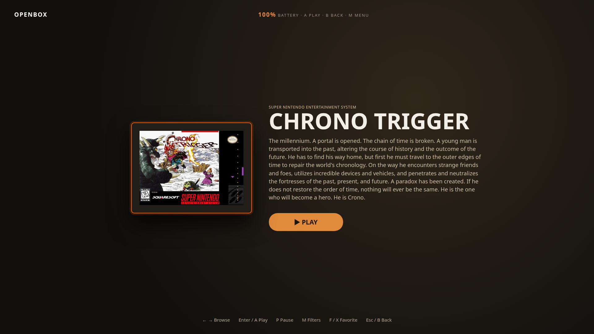

<p align="center">
  
</p>

<h1 align="center">
  <picture>
    <source media="(prefers-color-scheme: dark)" srcset="assets/openboxgl-title-dark.png">
    <source media="(prefers-color-scheme: light)" srcset="assets/openboxgl-title-light.png">
    
  </picture>
</h1>

<p align="center">
  Local-first game library and launcher for Linux
</p>

<p align="center">
  <a href="LICENSE"></a>
  <a href="https://www.python.org/downloads/"></a>
  <a href="https://github.com/vindeckyy/OpenBoxGL/releases/tag/v1.6.0"></a>
  <a href="https://github.com/vindeckyy/OpenBoxGL/actions/workflows/ci.yml"></a>
  <a href="https://github.com/vindeckyy/OpenBoxGL/releases/latest"></a>
  <br>
  <a href="https://github.com/vindeckyy/OpenBoxGL/releases/latest"><strong>Latest stable: v1.6.0</strong></a>
</p>

<p align="center">
  <a href="https://www.buymeacoffee.com/haydenopenbox" target="_blank" rel="noopener noreferrer">
    
  </a>
</p>

<p align="center">
  <a href="#quick-start">Quick Start</a> |
  <a href="#overview">Overview</a> |
  <a href="#why-openbox-on-linux">Why OpenBox on Linux</a> |
  <a href="#features">Features</a> |
  <a href="#screenshots">Screenshots</a> |
  <a href="#installation">Installation</a> |
  <a href="#documentation">Documentation</a> |
  <a href="#rest-api">REST API</a> |
  <a href="#faq">FAQ</a> |
  <a href="#development">Development</a> |
  <a href="#legal">Legal</a>
</p>

<p align="center">
  <a href="#screenshots">
    
  </a>
  <br>
  <sub>One library for Steam, ROMs, and emulators. Click for more screenshots.</sub>
</p>

---

## Quick Start

1. **Install.** Grab the [latest AppImage](https://github.com/vindeckyy/OpenBoxGL/releases/latest), or run from source with `python3 web_app.py` (Python 3.10+).
2. **Open the UI.** `openbox` opens a native WebKitGTK window by default, and falls back to a chrome-less app window (then your default browser) when WebKitGTK is missing. `openbox --web` skips the native window and opens the loopback web UI in a browser; from source, `python3 web_app.py` also opens the browser automatically with the token in the URL. To open the UI manually, append the token from the data directory, e.g. open `http://127.0.0.1:PORT/?token=$(cat ~/.local/share/openbox-game-launcher/server.token)`.
3. **Import games.** Click **Import Folder** and point at a directory of `.sh` files, or **Import Steam** to scan your installed games.
4. **Press PLAY.** Sessions, play time, and history are tracked automatically.

For ROMs, emulators, Big Box, RetroAchievements, and everything else, see [Getting started](https://openboxgl.github.io/getting-started/) and [Installation](https://openboxgl.github.io/install/).

---

## Overview

OpenBox Game Launcher is an open-source game library manager and launcher for Linux. It puts Steam, Heroic (Epic/GOG/Amazon), Lutris, Faugus, Gameyfin, ROM folders, ScummVM, RPCS3, Vita3K, and Eden Switch collections, and local executables in one searchable catalog with advanced search, ordered playlists, artwork galleries, session tracking, save and library backups, launch profiles, and controller-ready Big Box mode. No account, no cloud, no telemetry.

OpenBox Game Launcher is unrelated to [Openbox](https://openbox.org/), the open-source Linux window manager. The projects have different maintainers, codebases, and purposes.

OpenBox provides one UI over two hosts:

| Host | Entry point | Best for |
| --- | --- | --- |
| Native window | `openbox` or `openbox-native` | Default desktop use; one WebKitGTK window renders the full UI |
| Web UI | `openbox --web` or `python3 web_app.py` | Development and debugging; full feature set, REST API, Big Box mode |

Library data is stored locally at `~/.local/share/openbox-game-launcher/library.json`. Set the `OPENBOX_DATA_DIR` environment variable to use a different data directory.

> **Independence notice:** OpenBox Game Launcher is an independent open-source project. It is not affiliated with LaunchBox, Unbroken Software, LLC, or the Openbox window manager project. LaunchBox and Big Box are trademarks of Unbroken Software, LLC. See [DISCLAIMER.md](docs/DISCLAIMER.md).

---

## Why OpenBox on Linux

LaunchBox has no native Linux build and charges Premium for workflows that OpenBox includes free. Key differences:

| Topic | OpenBox | LaunchBox on Linux |
| --- | --- | --- |
| License | AGPL-3.0, full source | Proprietary, no Linux build |
| Cost | Free, no subscription | Premium paywall for advanced workflows |
| Data | Local JSON, no account | Cloud library (Premium) |
| Linux-native | Steam, Heroic, Lutris, RetroArch, ROMs, Arcade | Windows-first, Linux via compatibility layers |
| Automation | Local REST API with token auth | Limited external automation surface |
| Handheld / couch use | Big Box mode with controller navigation, AppImage portability, Steam Game Mode guest (`--game-mode`) | Big Box exists, but Linux handheld workflows are secondary |

Consider OpenBox if you:

- Run Linux on a desktop, laptop, Steam Deck, or handheld PC
- Want one library for Steam, Heroic, Lutris, Gameyfin, ROMs, and standalone emulators
- Prefer local JSON library state over vendor cloud lock-in
- Need Flathub-aware emulator install/update flows
- Want RetroAchievements, save backups, session history, and Big Box in one app

The full capability matrix with acceptance checks lives in [PARITY.md](docs/PARITY.md).

---

## Features

### Library & Discovery

One catalog for Steam, Heroic, Lutris, Gameyfin, ROM folders, ScummVM, RPCS3, Vita3K, and local executables. Advanced search, collections, playlists, tags, bulk edits, custom fields, ESRB filtering, list view, and Surprise Me random selection.

### Metadata & Media

LaunchBox Games Database sync (covers, backgrounds, screenshots, box backs, spines, 3D boxes, clear logos, fanart, banners, title screens, carts, discs, and advertisement flyers), IGDB search, Steam/GOG media, EmuMovies, Bezel Project, bundled media packs (platform logos, controller prompts, badges), duplicate cleanup, region priority, download limits.

### Emulators & Launching

Auto-detect emulators on `$PATH`, Flathub install/update, YAML definition packs, archive extraction (ZIP/7z/RAR), safe tokenized commands, per-game launch overrides. Example emulator profile:

```
SNES = retroarch -L /usr/lib/libretro/snes9x_libretro.so "{path}"
```

Tokens: `{path}`, `{name}`, `{rom_name}`, `{app_id}`, `{heroic_app_id}`, `{lutris_id}`.

### Sessions & Saves

Play time tracking, session history, save discovery (Steam Cloud, RetroArch, PCSX2, PPSSPP, RPCS3, Dolphin, Cemu), versioned backups with retention limits, Ludusavi/Hoard CLI hooks, RetroAchievements (hardcore, beaten, mastered, badge injection).

### Big Box & Handhelds

Fullscreen Stage/Hybrid/CoverFlow layouts, gamepad navigation, screensaver/attract mode, optional startup video, library BGM, Steam Game Mode guest (`--game-mode`), localization (English; more languages planned).

### Extensibility

REST API with token auth, Python plugins (`library`, `before_launch`, `after_session` hooks), local CSS themes with live reload, HMAC-signed webhooks, mounted-folder statistics sync, `openbox://` deep links.

[Full feature list in the documentation](https://openboxgl.github.io/)

---

## Screenshots

<p align="center">
  <strong>Library</strong>: grid and list views, platform filters, ordered playlists, status badges, and drag-and-drop import
</p>

<p align="center">
  <a href="assets/openbox-screenshot.png">
    
  </a>
</p>

<p align="center">
  <strong>Game detail</strong>: metadata, ratings, play history, hero art, and one-click launch
</p>

<p align="center">
  <a href="assets/openbox-game-detail.png">
    
  </a>
</p>

<p align="center">
  <strong>Big Box</strong>: fullscreen controller navigation with Stage layout
</p>

<p align="center">
  <a href="assets/openbox-bigbox.png">
    
  </a>
</p>

<p align="center">
  <sub>Screenshots use real LaunchBox metadata and cover art. Regenerate with <code>python3 scripts/capture_readme_screenshots.py</code> (requires Node.js 22.12+; run <code>cd scripts && npm ci</code> first for Puppeteer).</sub>
</p>

---

## Installation

| Method | Best for | Notes |
| --- | --- | --- |
| AppImage (installer) | Desktop, Steam Deck, handhelds, immutable systems | Built-in verified updater, installs to `~/.local/bin` |
| AppImage (manual) | Offline or custom path | `chmod +x` and run, no install step |
| Flatpak | Sandboxed installs | `flatpak-builder` from manifest |
| Source | Development, patching | `git clone` and `python3 web_app.py` |
| System | Install to `/usr/local` | `sudo make install` |

### Versioned release installer

Download the installer from a specific signed release, inspect it, then run it. The installer verifies the release public-key pin, SHA-256 checksum, and Ed25519 signature before installing to `~/.local/bin`:

```bash
VERSION=1.6.0
curl --proto '=https' --tlsv1.2 --fail --location \
  --output install.sh \
  "https://github.com/vindeckyy/OpenBoxGL/releases/download/v${VERSION}/install.sh"
less install.sh
OPENBOX_RELEASE_TAG="v${VERSION}" bash install.sh
```

To launch OpenBox right after installing, pass `--run` after the tag-pinned invocation:

```bash
OPENBOX_RELEASE_TAG="v${VERSION}" bash install.sh --run
```

Omit `OPENBOX_RELEASE_TAG` only when you intentionally want the latest stable release. Install to a different directory with `OPENBOX_INSTALL_DIR` (for example, `OPENBOX_INSTALL_DIR="$HOME/Applications"`).

### AppImage (manual)

Download the latest release from [GitHub Releases](https://github.com/vindeckyy/OpenBoxGL/releases/latest).

```bash
chmod +x OpenBox-x86_64.AppImage
./OpenBox-x86_64.AppImage
```

The AppImage opens the native window by default. To use the loopback web UI instead, pass `--web`:

```bash
./OpenBox-x86_64.AppImage --web
```

Desktop integrators such as Gear Lever work with the AppImage. If an older build opened then never showed a window after integration, install **v0.6.0 or newer**, remove the old menu entry, and re-add the AppImage.

### System install

```bash
sudo make install
openbox          # Native window (default)
openbox --web    # Web UI (development)
```

### Flatpak

```bash
flatpak-builder --user --install --force-clean build-dir io.openbox.GameLauncher.yml
flatpak run io.openbox.GameLauncher
```

### From source

```bash
git clone https://github.com/vindeckyy/OpenBoxGL.git
cd OpenBoxGL
python3 web_app.py
```

Requirements: Python 3.10 or newer on a Linux system with standard desktop tooling. The native window additionally needs WebKitGTK 4.1 (`make native-host` builds `native_host`); `python3 web_app.py` runs without it.

Optional local configuration can be loaded from an explicit `OPENBOX_ENV_FILE`, the data directory (or its parent), `~/.env`, or `~/.config/openbox-game-launcher/.env`. See `.env.example`. Never commit secrets.

---

## Documentation

The full user documentation is at [openboxgl.github.io](https://openboxgl.github.io/).

| Resource | What it covers |
| --- | --- |
| [Getting started](https://openboxgl.github.io/getting-started/) | First-run walkthrough with disposable folder |
| [Installation](https://openboxgl.github.io/install/) | AppImage, Flatpak, source, troubleshooting |
| [Library overview](https://openboxgl.github.io/guides/library/) | Browse, search, filters, health audit |
| [Importing](https://openboxgl.github.io/guides/library/importing/) | Steam, Heroic, Lutris, Faugus, ROM folders, arcade, Gameyfin |
| [Proton & Wine](https://openboxgl.github.io/guides/wine-and-proton/) | Windows game runners, Wine prefixes, and Proton runtime environments |
| [Emulators and launching](https://openboxgl.github.io/guides/emulators-and-launching/) | Profiles, tokens, archives, dependency checks |
| [Big Box and handhelds](https://openboxgl.github.io/guides/big-box-and-handhelds/) | Layouts, gamepad, gamescope, TDP profiles |
| [Sessions, saves, and backups](https://openboxgl.github.io/guides/sessions-saves-and-backups/) | History, save discovery, versioned backups |
| [RetroAchievements](https://openboxgl.github.io/guides/retroachievements/) | Matching, hardcore, badge injection |
| [Plugins](https://openboxgl.github.io/guides/plugins/) | Install, hooks, safe mode |
| [REST API](https://openboxgl.github.io/reference/api/) | Full endpoint documentation |
| [PARITY.md](docs/PARITY.md) | LaunchBox capability matrix |
| [docs/SUPPORT.md](docs/SUPPORT.md) | Supported platforms, runtimes, and reporting guidance |
| [docs/reliability.md](docs/reliability.md) | Edge case catalog and expected behavior |
| [CHANGELOG.md](docs/CHANGELOG.md) | Release history |
| [CONTRIBUTING.md](docs/CONTRIBUTING.md) | Development workflow and contribution guidelines |
| [SECURITY.md](docs/SECURITY.md) | Security reporting process |

---

## REST API

The Web UI exposes a local REST API for automation. Authenticate with `X-OpenBox-Token`:

```bash
# Find your token and port (only while the Web UI is running)
cat ~/.local/share/openbox-game-launcher/server.token
cat ~/.local/share/openbox-game-launcher/server.port

# List your library
TOKEN=$(cat ~/.local/share/openbox-game-launcher/server.token)
PORT=$(cat ~/.local/share/openbox-game-launcher/server.port)
curl -H "X-OpenBox-Token: $TOKEN" http://127.0.0.1:$PORT/api/library | jq '.games | length'

# Launch a game by stable ID
curl -X POST -H "X-OpenBox-Token: $TOKEN" \
  -H "Content-Type: application/json" \
  -d '{"game_id": "GAME_ID"}' \
  http://127.0.0.1:$PORT/api/launch
```

Full endpoint documentation: [REST API](https://openboxgl.github.io/reference/api/).

---

## FAQ

### Does OpenBox include games or ROMs?

No. OpenBox does not distribute games, ROMs, BIOS files, firmware, or DRM circumvention tools. You supply the files; OpenBox catalogs, launches, and tracks them.

### Does it require an online account?

No OpenBox account is required. Optional integrations (RetroAchievements, EmuMovies, IGDB) have their own accounts and credentials. The library is stored locally under your control.

### Is Windows supported?

OpenBox targets Linux (desktop, Steam Deck, handhelds). Windows-only features are documented as boundaries in [PARITY.md](docs/PARITY.md). If you need Windows, LaunchBox remains a strong option.

---

## Development

### Project layout

```
OpenBox/
├── native_host.c           Native WebKitGTK host (spawns web_app.py)
├── handlers/               Route handler mixins (library, media, imports, settings, ...)
├── web_app.py              Loopback server + REST API (shared core)
├── routes.py               GET/POST route tables (110 GET + 139 POST entries; v1_contracts.json freezes 60 paths)
├── contracts.py            Frozen v1 API contract + legacy aliases
├── openbox.py              Shared core helpers (data paths, launch, profiles)
├── state_store.py          Schema-versioned state, atomic writes, snapshots
├── settings_schema.py      Settings key whitelist
├── api_errors.py           Structured API error codes
├── job_manager.py          Background job lifecycle
├── importers.py            Steam, Heroic, Lutris, ROM imports
├── pkg/parity/parity_*.py     Parity modules (shim at root for compat)
├── emulators.py            Emulator profiles + Flathub management
├── metadata.py             LaunchBox DB sync + media scraping
├── retroachievements.py    RA matching + badge injection
├── saves.py                Save discovery + backup engine
├── updates.py              Verified GitHub updater
├── env_config.py           .env loading + credential aliases
├── plugins.py              Plugin lifecycle + hooks
├── plugin_catalog.py       Bundled community catalog
├── catalog.py              Search, filters, bulk edits
├── stock_themes.py         Bundled CSS theme installer
├── themes/                 Stock themes (5 CSS files)
├── emulator_defs/          YAML definition packs
├── scripts/                Build, test, screenshot capture
├── tests/test_*.py            Test suite (69 files)
```

### Run tests

```bash
./run_all_tests.sh
```

Build the native window host and the AppImage:

```bash
make native-host     # WebKitGTK window host (needs libwebkit2gtk-4.1)
./build_appimage.sh
```

Pull requests should pass the full test suite. See [CONTRIBUTING.md](docs/CONTRIBUTING.md).

---

## Legal

OpenBox Game Launcher is released under the [GNU Affero General Public License v3.0](LICENSE).

Trademark references to LaunchBox, Steam, Heroic, Lutris, RetroArch, and other third-party products are used for compatibility description only. OpenBox does not distribute ROMs, BIOS files, firmware, or DRM circumvention tools.

For the full legal policy, see [DISCLAIMER.md](docs/DISCLAIMER.md) and [TRADEMARKS.md](docs/TRADEMARKS.md).

---

## Support

OpenBox is free and open source (AGPL-3.0). If it saves you time, a coffee helps cover hosting and development:

<p align="center">
  <a href="https://www.buymeacoffee.com/haydenopenbox" target="_blank" rel="noopener noreferrer">
    
  </a>
</p>

- [Report a bug](https://github.com/vindeckyy/OpenBoxGL/issues/new?template=bug_report.yml)
- [Request a feature](https://github.com/vindeckyy/OpenBoxGL/issues/new?template=feature_request.yml)
- [Review open issues](https://github.com/vindeckyy/OpenBoxGL/issues)

Contributions are welcome. Please read [CONTRIBUTING.md](docs/CONTRIBUTING.md) and [CODE_OF_CONDUCT.md](docs/CODE_OF_CONDUCT.md) before opening a pull request.
