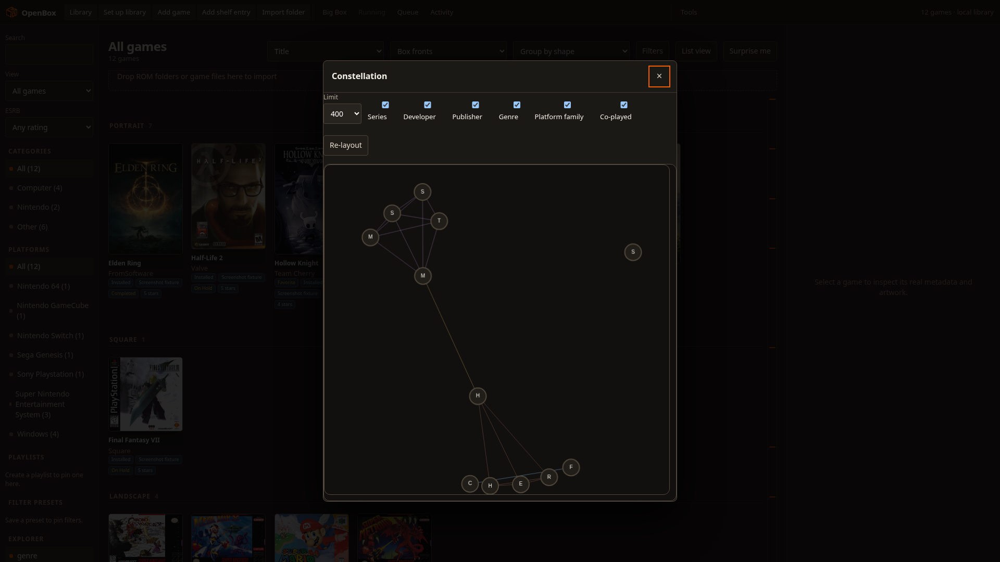

<p align="center">
  
</p>

<h1 align="center">
  <picture>
    <source media="(prefers-color-scheme: dark)" srcset="assets/openboxgl-title-dark.png">
    <source media="(prefers-color-scheme: light)" srcset="assets/openboxgl-title-light.png">
    
  </picture>
</h1>

<p align="center">
  Local-first game library and launcher for Linux and Windows
</p>

<p align="center">
  <a href="LICENSE"></a>
  <a href="https://www.python.org/downloads/"></a>
  <a href="https://github.com/vindeckyy/OpenBoxGL/releases/tag/v1.13.1"></a>
  <a href="https://github.com/vindeckyy/OpenBoxGL/actions/workflows/ci.yml"></a>
  <a href="https://github.com/vindeckyy/OpenBoxGL/releases/latest"></a>
  <br>
  <a href="https://github.com/vindeckyy/OpenBoxGL/releases/latest"><strong>Latest stable: v1.13.1</strong></a>
</p>

<p align="center">
  <a href="https://www.buymeacoffee.com/haydenopenbox" target="_blank" rel="noopener noreferrer">
    
  </a>
</p>

<p align="center">
  <a href="#quick-start">Quick Start</a> |
  <a href="#overview">Overview</a> |
  <a href="#why-openbox-on-linux">Why OpenBox on Linux</a> |
  <a href="#features">Features</a> |
  <a href="#screenshots">Screenshots</a> |
  <a href="#installation">Installation</a> |
  <a href="#documentation">Documentation</a> |
  <a href="#rest-api">REST API</a> |
  <a href="#faq">FAQ</a> |
  <a href="#development">Development</a> |
  <a href="#legal">Legal</a>
</p>

<p align="center">
  <a href="#screenshots">
    
  </a>
  <br>
  <sub>One library for Steam, ROMs, and emulators. Click for more screenshots.</sub>
</p>

---

## Quick Start

1. **Install.** On Linux grab the [latest AppImage](https://github.com/vindeckyy/OpenBoxGL/releases/latest); on Windows run the signed `install.ps1` from the same release. Either way you can run from source with `python3 web_app.py` (Python 3.10+).
2. **Open the UI.** `openbox` opens a native window (WebKitGTK on Linux, WebView2 on Windows) and falls back to a chrome-less app window, then your default browser, when the host runtime is missing. `openbox --web` skips the native host and opens the loopback UI in a browser app window (plain tab fallback); from source, `python3 web_app.py` also opens the browser automatically with the token in the URL. Steam Deck / gamescope kiosk: `python3 web_app.py --game-mode` or `openbox --web --game-mode`. To open the UI manually, append the token from the data directory, e.g. open `http://127.0.0.1:PORT/?token=$(cat ~/.local/share/openbox-game-launcher/server.token)`. Treat token-bearing URLs as secrets; prefer the `X-OpenBox-Token` header for scripts and never paste or share the URL.
3. **Import games.** Click **Import Folder** and point at a directory of `.sh` files, or **Import Steam** to scan your installed games.
4. **Press PLAY.** Sessions, play time, and history are tracked automatically.

For ROMs, emulators, Big Box, RetroAchievements, and everything else, see [Getting started](https://openboxgl.github.io/getting-started/) and [Installation](https://openboxgl.github.io/install/).

---

## Overview

OpenBox Game Launcher is an open-source game library manager and launcher for Linux and Windows. It puts Steam, Heroic (Epic/GOG/Amazon), Lutris, Faugus, Gameyfin, ROM folders, ScummVM, RPCS3, Vita3K, and Eden Switch collections, and local executables in one searchable catalog with advanced search, ordered playlists, artwork galleries, session tracking, save and library backups, launch profiles, and controller-ready Big Box mode. No account, no vendor cloud lock-in, and no telemetry; optional mounted-folder sync stays under your control.

OpenBox Game Launcher is unrelated to [Openbox](https://openbox.org/), the open-source Linux window manager. The projects have different maintainers, codebases, and purposes.

OpenBox provides one UI over two use-case entry points (the native host renders the same `web_app.py` loopback UI):

| Entry point | Use when |
| --- | --- |
| `openbox` or `openbox-native` | Default desktop use; one native window (WebKitGTK on Linux, WebView2 on Windows) renders the full UI |
| `openbox --web` or `python3 web_app.py` | Development and debugging; full feature set, REST API, Big Box mode |

Library data is stored locally at `~/.local/share/openbox-game-launcher/library.json` (`%LOCALAPPDATA%\openbox-game-launcher\library.json` on Windows). Set the `OPENBOX_DATA_DIR` environment variable to use a different data directory.

> **Independence notice:** OpenBox Game Launcher is an independent open-source project. It is not affiliated with LaunchBox, Unbroken Software, LLC, or the Openbox window manager project. LaunchBox and Big Box are trademarks of Unbroken Software, LLC. See [DISCLAIMER.md](docs/DISCLAIMER.md).

---

## Why OpenBox on Linux

LaunchBox has no native Linux build and charges Premium for workflows that OpenBox includes free. Key differences:

| Topic | OpenBox | LaunchBox on Linux |
| --- | --- | --- |
| License | AGPL-3.0, full source | Proprietary, no Linux build |
| Cost | Free, no subscription | Premium paywall for advanced workflows |
| Data | Local JSON, no account | Cloud library (Premium) |
| Linux-native | Steam, Heroic, Lutris, RetroArch, ROMs, Arcade | Windows-first, Linux via compatibility layers |
| Automation | Local REST API with token auth | Limited external automation surface |
| Handheld / couch use | Big Box mode with controller navigation, AppImage portability, Steam Game Mode guest (`--game-mode`) | Big Box exists, but Linux handheld workflows are secondary |

Consider OpenBox if you:

- Run Linux on a desktop, laptop, Steam Deck, or handheld PC
- Want one library for Steam, Heroic, Lutris, Gameyfin, ROMs, and standalone emulators
- Prefer local JSON library state over vendor cloud lock-in
- Need Flathub-aware emulator install/update flows
- Want RetroAchievements, save backups, session history, and Big Box in one app

OpenBox also runs on Windows, installed from a signed portable zip and rendered in a WebView2 window. The Linux-specific machinery — AppImage and Flatpak packaging, gamescope/Game Mode, XDG desktop entries, and Flatpak-aware emulator installs — stays Linux-only.

The full capability matrix with acceptance checks lives in [PARITY.md](docs/PARITY.md).

---

## Features

### Living Library (1.12.0)

Saved Backlog Radio searches pin as named **smart collections** that
re-evaluate live — the shelf stores the question, not the answer. Every game
gains a **Story** tab narrating its journey: added, first played, longest
session, milestones, progress, and captured Moments. The launch sheet gains
per-game `KEY=value` environment overrides and an optional confirm-before-
launch step, and an opt-in **weekly automatic backup** keeps a bounded archive
history with a last-run line in Settings. The SQLite read model is
opt-in via `OPENBOX_ENABLE_SQLITE_READ=1`, auto-enabled at 5,000+ games
unless opted out (`=0`); JSON stays the source of truth, and the command palette ranks recently
used games and actions first.

### Every Second Counts (1.11.0)

Quick Resume and Moments keep save-state-aware progress, captures, and session
recaps close to the game you were playing. Record That adds replay-buffer clips
and deterministic highlight reels. The Time Machine provides journal-backed
history and safe as-of inspection, while Backlog Radio, the explainable natural
query bar, and the command palette make a large backlog easier to navigate.

The Arcade Room and Museum mode turn the library into a controller-friendly
showcase, with an optional local kiosk PIN convenience boundary. Household
records provide opt-in, server-free challenges and leaderboards. Steam Bridge
can preview and manage non-Steam shortcuts, and ES-DE `gamelist.xml` imports are
reviewable before they change the library.

### Library & Discovery

One catalog for Steam, Heroic, Lutris, Faugus, Gameyfin, ROM folders, ScummVM, RPCS3, Vita3K, Eden, arcade (MAME), and local executables. Advanced search, collections, playlists, tags, bulk edits, custom fields, ESRB filtering, list view, **"What should I play?" smart picker** (time, mood, familiarity, players) plus Surprise Me random selection, and a pan/zoomable **Library Constellation** relationship graph. **Keyboard and gamepad navigation** across the grid and list (arrows/Home/End/Page, `f` favorite, Escape clear, configurable controller map), **hash routing** so refresh and shared links restore platform/playlist/preset/query/selection/sort, sortable list-view columns with persisted direction, screenshot lightbox with prev/next/zoom, cover skeleton loading, and **Mood Match adaptive cover theming** that tints accents from the selected game.

### Metadata & Media

LaunchBox Games Database sync (covers, backgrounds, screenshots, box backs, spines, 3D boxes, clear logos, fanart, banners, title screens, carts, discs, and advertisement flyers), IGDB search, Steam/GOG media, EmuMovies, Bezel Project, **ScreenScraper** per-ROM-hash scraping (credentials in `~/.env`, 1 req/s throttle, 30-day cache), optional **SteamGridDB** artwork search/apply and bulk matching for covers, backgrounds, clear logos, icons, and banners (credentials in `~/.env`, local cache), bundled media packs (platform logos, controller prompts, badges), duplicate cleanup, region priority, download limits.

### Emulators & Launching

Auto-detect emulators on `$PATH`, Flathub install/update, YAML definition packs, archive extraction (ZIP/7z/RAR), safe tokenized commands, per-game launch overrides, BIOS SHA1 drift detection in Launch Doctor. Example emulator profile:

```
SNES = retroarch -L /usr/lib/libretro/snes9x_libretro.so "{path}"
```

Tokens: `{path}`, `{name}`, `{rom_name}`, `{app_id}`, `{heroic_app_id}`, `{lutris_id}` — see the [command-tokens reference](https://openboxgl.github.io/reference/command-tokens/) for the full placeholder list.

### Sessions & Saves

Play time tracking, session history, save discovery (Steam Cloud, RetroArch, PCSX2, PPSSPP, RPCS3, Dolphin, Cemu), versioned backups with retention limits, Ludusavi/Hoard CLI hooks, RetroAchievements (hardcore, beaten, mastered, badge injection). OpenBox launcher trophies are a separate local, deterministic trophy case evaluated from library and history.

### Play Insights

Local-first playtime analytics with a 366-day activity heatmap (levels 0–4), current and longest play streaks, 30-day play momentum, and top platforms/genres. **OpenBox Wrapped** prints your year in games (playtime, streaks, progress, busiest month), the **History Timeline** tab groups sessions by day, and the **Mastery Map** dashboard breaks the library into per-platform and per-decade progress bars with RetroAchievements columns. The **launcher trophy case** evaluates deterministic OpenBox milestones from local library/history data; these awards are separate from RetroAchievements. Computed entirely locally with zero telemetry.

### Big Box & Handhelds

Fullscreen Stage/Hybrid/CoverFlow layouts, gamepad navigation, screensaver/attract mode, optional startup video, library BGM, **video snaps** (looping gameplay videos in Stage mode with debounce and BGM ducking), **Game Night party mode** (couch-multiplayer queue, spinning wheel, up-next strip, persistent rounds), Steam Game Mode guest (`--game-mode`), gamescope presets (Steam Deck, Steam Deck HD, 1080p, 1440p, 4K, integer scale, stretch, borderless) plus **custom user-defined presets with per-game override**, MangoHud performance overlay toggle, controller bench with live gamepad SVG visualization, localization (English, Spanish, German, French, Portuguese).

### Scale & Backups

Optional SQLite read model (opt-in via `OPENBOX_ENABLE_SQLITE_READ=1`, auto-enabled at 5,000+ games unless opted out (`=0`); JSON stays the source of truth) with canonical name-substring search and JSON-equivalent facets for large libraries, wired into `/api/v2/library/search`. Backup diff API (`GET /api/v2/backup/diff`) to compare current library against archives. Visual chip builder for smart collection filter presets. **Library export** to JSON or CSV with platform/playlist scopes, shareable-by-construction field projection, and automatic newest-10 rotation. Statistics sync remains available through the mounted-folder workflow; the opt-in causal transport provides validated catalog sync with conflict review and tombstones, while the legacy whole-library publish/pull routes return `LIBRARY_SYNC_UNAVAILABLE` before mutation. **LaunchBox XML migration** import (`POST /api/v2/import/launchbox/preview` and `/apply`). **Manual/shelf entries** for games without local files.

For the review-first workflows, use the UI rather than copying paths or records by hand:

- **LaunchBox XML:** open the LaunchBox migration panel, choose one bounded XML export, review the parsed entries, path mappings, exclusions, and emulator mappings, then apply the preview. A changed file or library invalidates the preview and requires a new review; XML never supplies executable commands.
- **Catalog sync:** configure a mounted folder in Settings, enable **library catalog sync**, preview incoming changes, choose alternatives for conflicts, apply the reviewed plan, and publish local changes explicitly. Paths, launch commands, credentials, media, and play statistics remain local; apply requires the reviewed plan and publish is an explicit separate step.
- **Shelf entries:** use **Add shelf entry** for a title without a local file. Shelf records can be edited, filtered, and exported, then converted to a playable entry only after selecting an existing absolute file.

The SQLite read model is opt-in via `OPENBOX_ENABLE_SQLITE_READ=1`, auto-enabled at 5,000+ games unless opted out (`=0`); JSON stays the source of truth. The release gate covers 10,000 and 20,000-game libraries; behavior and performance beyond 20,000 games are exploratory.

### Extensibility

REST API with token auth, Python plugins (`library`, `before_launch`, `after_session` hooks), local CSS themes with instant apply, HMAC-signed webhooks, mounted-folder statistics sync, `openbox://` deep links.

[Full feature list in the documentation](https://openboxgl.github.io/)

---

## Screenshots

<p align="center">
  <strong>Library</strong>: grid and list views, platform filters, ordered playlists, status badges, and drag-and-drop import
</p>

<p align="center">
  <a href="assets/openbox-screenshot.png">
    
  </a>
</p>

<p align="center">
  <strong>Game detail</strong>: metadata, ratings, play history, hero art, and one-click launch
</p>

<p align="center">
  <a href="assets/openbox-game-detail.png">
    
  </a>
</p>

<p align="center">
  <strong>Big Box</strong>: fullscreen controller navigation with Stage layout
</p>

<p align="center">
  <a href="assets/openbox-bigbox.png">
    
  </a>
</p>

<p align="center">
  <strong>Constellation</strong>: library relationship graph with series, developer, and genre edges
</p>

<p align="center">
  <a href="assets/openbox-constellation.png">
    
  </a>
</p>

<p align="center">
  <sub>Screenshots use real LaunchBox metadata and cover art. Regenerate with <code>python3 scripts/capture_readme_screenshots.py</code> (requires Node.js 22.12+; run <code>cd scripts && npm ci</code> first for Puppeteer).</sub>
</p>

---

## Installation

| Method | Best for | Notes |
| --- | --- | --- |
| AppImage (installer) | Linux desktop, Steam Deck, handhelds, immutable systems | Architecture-matched signed installer and built-in verified updater; installs to `~/.local/bin` |
| Windows (installer) | Windows 10/11 (x86_64) | Signed portable zip, verified updater, WebView2 window; installs to `%LOCALAPPDATA%\OpenBox` |
| AppImage (manual) | Offline or custom path | `chmod +x` and run, no install step |
| Flatpak | Sandboxed installs | `flatpak-builder` from manifest |
| Source | Development, patching | `git clone` and `python3 web_app.py` |
| System | Install to `/usr/local` | `sudo make install` |

### Versioned release installer

Download the installer from a specific signed release, inspect it, then run it. The installer detects `uname -m` (override with `OPENBOX_ARCH=x86_64` or `OPENBOX_ARCH=aarch64`), selects the matching AppImage, and verifies the release public-key pin, SHA-256 checksum, and Ed25519 signature before installing to `~/.local/bin`:

```bash
VERSION=1.13.1
curl --proto '=https' --tlsv1.2 --fail --location \
  --output install.sh \
  "https://github.com/vindeckyy/OpenBoxGL/releases/download/v${VERSION}/install.sh"
less install.sh
OPENBOX_RELEASE_TAG="v${VERSION}" bash install.sh
```

To launch OpenBox right after installing, pass `--run` after the tag-pinned invocation:

```bash
OPENBOX_RELEASE_TAG="v${VERSION}" bash install.sh --run
```

Omit `OPENBOX_RELEASE_TAG` only when you intentionally want the latest stable release. Install to a different directory with `OPENBOX_INSTALL_DIR` (for example, `OPENBOX_INSTALL_DIR="$HOME/Applications"`).

### Windows (installer)

Windows 10/11 on x86_64 installs from the signed portable zip. Download
`install.ps1` from a specific release, read it, then run it from Windows
PowerShell 5.1 (it needs no `curl` and no OpenSSL — verification uses the same
`updates.py` Ed25519 code path as the in-app updater):

```powershell
$Version = '1.13.1'
Invoke-WebRequest -UseBasicParsing -OutFile install.ps1 `
  "https://github.com/vindeckyy/OpenBoxGL/releases/download/v$Version/install.ps1"
notepad install.ps1   # read it before running it
.\install.ps1 -Tag "v$Version"
```

The installer resolves your CPU architecture, then verifies the release public
key against the pinned trust anchor, the archive's SHA-256 sidecar, and the
Ed25519 signature — nothing is extracted until all three pass. It installs to
`%LOCALAPPDATA%\OpenBox\share\openbox`, keeps the previous tree at
`share\openbox.previous`, adds the bin root to your user `PATH`, registers a
Start Menu shortcut, and registers the `openbox://` protocol handler.

| Option | Effect |
| --- | --- |
| `-Run` | Launch OpenBox when the install finishes |
| `-InstallDir <path>` | Install somewhere else (or set `OPENBOX_INSTALL_DIR`) |
| `-NoPathUpdate` | Leave the user `PATH` alone |
| `-Tag vX.Y.Z` | Install a specific release instead of the latest |
| `-Arch x86_64` | Override the detected architecture |
| `-ReleaseBase <url>` / `-Repo <owner/name>` | Use a mirror (or set `OPENBOX_RELEASE_BASE`) |
| `-PublicKeyPath <path>` | Trust a supplied release key (mirror/offline escape hatch) |

`openbox` then opens the UI in a WebView2 window and falls back to the
browser-based app window when the WebView2 runtime is absent; `openbox --web`
forces the browser. The in-app updater verifies and swaps the installed tree the
same way, and refuses to overwrite anything that is not an installed copy — a
`git clone` updates with `git pull`.

Each release also carries `OpenBox-x86_64-windows-native-host.exe` (with
`.sha256` and `.sig`): the compiled WebView2 host the zip ships, published on
its own so a source checkout gets a native window without the MSVC toolchain.
Save it beside `web_app.py` as `native_host.exe`, or point `OPENBOX_NATIVE_HOST`
at it.

### AppImage (manual)

Download the latest release from [GitHub Releases](https://github.com/vindeckyy/OpenBoxGL/releases/latest). Release artifacts are built for both **x86_64** and **aarch64**; pick the one matching your CPU (`uname -m`).

```bash
chmod +x OpenBox-$(uname -m).AppImage
./OpenBox-$(uname -m).AppImage
```

The AppImage opens the native window by default. To skip the WebKitGTK host and open the loopback UI in a browser app window (plain tab fallback), pass `--web`:

```bash
./OpenBox-x86_64.AppImage --web
```

Desktop integrators such as Gear Lever work with the AppImage. If an older build opened then never showed a window after integration, install **v0.6.0 or newer**, remove the old menu entry, and re-add the AppImage.

### System install

`make install` builds `native_host` first (needs `gcc` + `libwebkit2gtk-4.1-dev`):

```bash
sudo make install
openbox          # Native window (default)
openbox --web    # Skips WebKitGTK host, loopback UI in browser app window (plain tab fallback)
```

### Flatpak

```bash
flatpak-builder --user --install --force-clean build-dir io.openbox.GameLauncher.yml
flatpak run io.openbox.GameLauncher
```

### From source

```bash
git clone https://github.com/vindeckyy/OpenBoxGL.git
cd OpenBoxGL
python3 web_app.py
```

On Windows use `python web_app.py` (`python3` is a Microsoft Store alias that does not run scripts), or `.\openbox.cmd` with the WebView2 host: either build it with `scripts\build_native_host_windows.ps1` or download `OpenBox-x86_64-windows-native-host.exe` from a release and save it beside `web_app.py` as `native_host.exe`.

Requirements: Python 3.10 or newer. The native window additionally needs WebKitGTK 4.1 on Linux (`make native-host` builds `native_host`) or the WebView2 runtime on Windows (present on Windows 11 and most Windows 10 systems); `python3 web_app.py` runs without either.

Optional local configuration can be loaded from an explicit `OPENBOX_ENV_FILE`, the data directory (or its parent), `~/.env`, or `~/.config/openbox-game-launcher/.env`. See `.env.example`. Never commit secrets.

---

## Documentation

The full user documentation is at [openboxgl.github.io](https://openboxgl.github.io/).

| Resource | What it covers |
| --- | --- |
| [Getting started](https://openboxgl.github.io/getting-started/) | First-run walkthrough with disposable folder |
| [Installation](https://openboxgl.github.io/install/) | AppImage, Flatpak, source, troubleshooting |
| [Library overview](https://openboxgl.github.io/guides/library/) | Browse, search, filters, health audit |
| [Importing](https://openboxgl.github.io/guides/library/importing/) | Steam, Heroic, Lutris, Faugus, ROM folders, arcade, Gameyfin |
| [Proton & Wine](https://openboxgl.github.io/guides/wine-and-proton/) | Windows game runners, Wine prefixes, and Proton runtime environments |
| [Emulators and launching](https://openboxgl.github.io/guides/emulators-and-launching/) | Profiles, tokens, archives, dependency checks |
| [Big Box and handhelds](https://openboxgl.github.io/guides/big-box-and-handhelds/) | Layouts, gamepad, gamescope, TDP profiles |
| [Sessions, saves, and backups](https://openboxgl.github.io/guides/sessions-saves-and-backups/) | History, save discovery, versioned backups |
| [RetroAchievements](https://openboxgl.github.io/guides/retroachievements/) | Matching, hardcore, badge injection |
| [Plugins](https://openboxgl.github.io/guides/plugins/) | Install, hooks, safe mode |
| [REST API](https://openboxgl.github.io/reference/api/) | Full endpoint documentation |
| [PARITY.md](docs/PARITY.md) | LaunchBox capability matrix |
| [docs/SUPPORT.md](docs/SUPPORT.md) | Supported platforms, runtimes, and reporting guidance |
| [docs/reliability.md](docs/reliability.md) | Edge case catalog and expected behavior |
| [CHANGELOG.md](docs/CHANGELOG.md) | Release history |
| [CONTRIBUTING.md](docs/CONTRIBUTING.md) | Development workflow and contribution guidelines |
| [SECURITY.md](docs/SECURITY.md) | Security reporting process |

---

## REST API

The Web UI exposes a local REST API for automation. Authenticate with `X-OpenBox-Token`:

```bash
# Find your token and port (only while the Web UI is running)
cat ~/.local/share/openbox-game-launcher/server.token
cat ~/.local/share/openbox-game-launcher/server.port

# List your library
TOKEN=$(cat ~/.local/share/openbox-game-launcher/server.token)
PORT=$(cat ~/.local/share/openbox-game-launcher/server.port)
curl -H "X-OpenBox-Token: $TOKEN" http://127.0.0.1:$PORT/api/library | jq '.games | length'

# Launch a game by stable ID
curl -X POST -H "X-OpenBox-Token: $TOKEN" \
  -H "Content-Type: application/json" \
  -d '{"game_id": "GAME_ID"}' \
  http://127.0.0.1:$PORT/api/launch
```

Full endpoint documentation: [REST API](https://openboxgl.github.io/reference/api/).

---

## FAQ

### Does OpenBox include games or ROMs?

No. OpenBox does not distribute games, ROMs, BIOS files, firmware, or DRM circumvention tools. You supply the files; OpenBox catalogs, launches, and tracks them.

### Does it require an online account?

No OpenBox account is required. Optional integrations (RetroAchievements, EmuMovies, IGDB) have their own accounts and credentials. The library is stored locally under your control.

### Is Windows supported?

Yes. OpenBox runs on Windows 10/11 (x86_64) from a signed portable install: the same UI in a WebView2 window, the same library, imports, sessions, saves, Big Box mode, and REST API, with Windows binary names for every bundled emulator definition. Run `scripts/install.ps1` from a release, or `python web_app.py` from a checkout. Linux remains the primary target for the distro-integration surfaces — AppImage, Flatpak, gamescope/Game Mode, XDG desktop entries, and Flathub-aware emulator management are Linux-only, and the capability matrix in [PARITY.md](docs/PARITY.md) is written from the Linux side. See [ADR 0048](docs/adr/0048-windows-port.md) for the port's boundaries.

---

## Development

### Project layout

```
OpenBox/
├── native_host.c           Native WebKitGTK host (spawns web_app.py)
├── native_host_win.c       Native WebView2 host (spawns web_app.py)
├── pkg/platform_compat.py  The only platform seam (locking, processes, quoting, paths)
├── handlers/               Route handler mixins (library, media, imports, settings, ...)
├── web_app.py              Loopback server + REST API (shared core)
├── webapp_state.py         SSE/event bus facade over the canonical state owner
├── routes.py               GET/POST route tables (frozen v1 surface + additive v2 routes)
├── routes/                 `@route` decorator registry only (handlers are imported by web_app.py)
├── contracts.py            Frozen v1 API contract (v1_contracts.json); legacy `/api/library` + `/api/launch` aliases live in handlers/library.py, handlers/sessions.py via routes.py
├── openbox.py              Shared core helpers (data paths, launch, profiles)
├── static/                 Frontend JavaScript modules, search worker, and app.css
├── state_store.py          Schema-versioned state, atomic writes, snapshots
├── settings_schema.py      Settings key whitelist
├── api_errors.py           Structured API error codes
├── job_manager.py          Background job lifecycle adapter
├── importers.py            Steam, Heroic, Lutris, ROM imports
├── automation.py           HMAC-signed webhook delivery + event allowlists
├── backend_io.py           Bounded network and filesystem helpers
├── cloud_sync.py           Mounted-folder statistics sync
├── crash_report.py         Redacted diagnostic report generator
├── notifications.py        Persistent notification feed helpers
├── openbox_logging.py      Diagnostic logging with secret redaction
├── play_queue.py           Persistent play queue helpers
├── archives.py             Safe, cached archive extraction
├── arcade.py               MAME and FinalBurn full-set import
├── pkg/state/              Modularized state, caches, launch, and operations
├── pkg/parity/              Parity modules (flat `import parity_*` via MetaPathFinder bridge)
├── emulators.py            Emulator profiles + Flathub management
├── metadata.py             LaunchBox DB sync + media scraping
├── retroachievements.py    RA matching + badge injection
├── saves.py                Save discovery + backup engine
├── updates.py              Verified GitHub updater
├── env_config.py           .env loading + credential aliases
├── plugins.py              Plugin lifecycle + hooks
├── plugin_runner.py        Sandboxed plugin subprocess runner
├── plugin_catalog.py       Bundled community catalog
├── catalog.py              Search, filters, bulk edits
├── stock_themes.py         Bundled CSS theme installer
├── themes/                 Stock themes (5 CSS files)
├── emulator_defs/          YAML definition packs
├── scripts/                Build, test, screenshot capture
├── tests/test_*.py         Standalone test files run by ./run_all_tests.sh
```

### Run tests

```bash
./run_all_tests.sh
```

On Windows (no bash required):

```powershell
python scripts\run_windows_tests.py          # every test file, per-file pass/fail/timeout
python scripts\run_windows_tests.py test_platform_compat.py   # a subset
```

Build the native window hosts and the AppImage:

```bash
make native-host                  # WebKitGTK window host (needs libwebkit2gtk-4.1)
./build_appimage.sh
```

```powershell
scripts\build_native_host_windows.ps1   # WebView2 host (needs the MSVC build tools)
```

Pull requests should pass the full test suite. See [CONTRIBUTING.md](docs/CONTRIBUTING.md).

---

## Legal

OpenBox Game Launcher is released under the [GNU Affero General Public License v3.0](LICENSE).

Trademark references to LaunchBox, Steam, Heroic, Lutris, RetroArch, and other third-party products are used for compatibility description only. OpenBox does not distribute ROMs, BIOS files, firmware, or DRM circumvention tools.

For the full legal policy, see [DISCLAIMER.md](docs/DISCLAIMER.md) and [TRADEMARKS.md](docs/TRADEMARKS.md).

---

## Support

OpenBox is free and open source (AGPL-3.0). If it saves you time, a coffee helps cover hosting and development:

<p align="center">
  <a href="https://www.buymeacoffee.com/haydenopenbox" target="_blank" rel="noopener noreferrer">
    
  </a>
</p>

- [Report a bug](https://github.com/vindeckyy/OpenBoxGL/issues/new?template=bug_report.yml)
- [Request a feature](https://github.com/vindeckyy/OpenBoxGL/issues/new?template=feature_request.yml)
- [Review open issues](https://github.com/vindeckyy/OpenBoxGL/issues)

Contributions are welcome. Please read [CONTRIBUTING.md](docs/CONTRIBUTING.md) and [CODE_OF_CONDUCT.md](docs/CODE_OF_CONDUCT.md) before opening a pull request.
