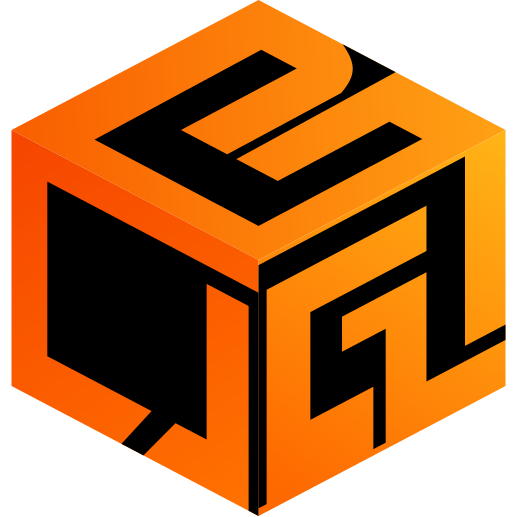

<p align="center">
  
</p>

<h1 align="center">OpenBox</h1>

<p align="center">
  <strong>The Ultimate Local-First Game Library & Launcher for Linux</strong>
</p>

<p align="center">
  <em>An open-source, modern LaunchBox alternative built for privacy, performance, and complete library control.</em>
</p>

<p align="center">
  <a href="LICENSE"></a>
  <a href="https://www.python.org/downloads/"></a>
  <a href="https://github.com/vindeckyy/OpenBox"></a>
  <a href="PARITY.md"></a>
</p>

<p align="center">
  <a href="#-overview">Overview</a> •
  <a href="#-key-features">Key Features</a> •
  <a href="#-quick-start">Quick Start</a> •
  <a href="#-screenshots">Screenshots</a> •
  <a href="#-architecture-overview">Architecture</a> •
  <a href="#-emulator-profiles--command-tokens">Emulator Profiles</a> •
  <a href="#-plugin-system-api">Plugins</a> •
  <a href="#-launchbox-parity-matrix">Parity Matrix</a> •
  <a href="#-legal-disclaimer">Disclaimer</a> •
  <a href="#-contributing">Contributing</a>
</p>

---

## 💡 Overview

**OpenBox** brings together your entire gaming universe on Linux into a unified, privacy-focused, and highly customizable interface. Whether you want to launch modern AAA PC titles from Steam, Heroic (Epic, GOG, Amazon), or Lutris, manage classic ROM collections with RetroArch and standalone emulators, or track RetroAchievements — **OpenBox handles it all locally without cloud lock-in.**

Featuring both a feature-packed **Modern Browser Web UI** (with REST API) and a lightning-fast **Native Tk Interface**, OpenBox adapts to desktop PCs, handheld devices (Steam Deck, ROG Ally), and couch gaming setups via its controller-first **Big Box Mode**.

---

## ⚡ Key Features

### 🎮 Unified Library & Smart Discovery
- **Multi-Source Aggregation**: Seamlessly merges native Linux binaries, retro ROMs, Steam titles, Heroic Games Launcher (Epic, GOG, Amazon), and Lutris (EA, Ubisoft) into one catalog.
- **Automated Game Import**: Scans installed manifests, Steam libraries, and recursive ROM folders with intelligent file-extension detection.
- **MAME & FinalBurn DAT Awareness**: Parses official XML/DAT catalogs to classify merged, split, and non-merged arcade ROM sets while automatically identifying BIOS files.
- **Smart Filtering & Collections**: Create custom collections, save dynamic search presets, and filter by platform, genre, developer, series, or missing media.
- **"Surprise Me" Picker**: Instant randomized game selection from your active filter view.

### 🖼️ LaunchBox Database & Media Engine
- **Daily LaunchBox Sync**: Synchronizes with the official LaunchBox Games Database for accurate local metadata matching.
- **Rich Media Scraper**: Auto-downloads high-resolution cover art, background wallpapers, logos, and gameplay screenshots.
- **Media Audit & Image Groups**: Browse image groups, manage per-game artwork, and execute bulk media downloads across matched libraries.

### 🕹️ Emulator & Session Orchestration
- **Auto-Discovery & One-Click Installs**: Automatically detects system emulators on your `$PATH` or installs them via Flathub (Dolphin, PCSX2, RPCS3, PPSSPP, Cemu, MAME, xemu, etc.).
- **Safe Command Tokenization**: Robust argument parser with `{path}`, `{rom_name}`, `{app_id}`, and custom command overrides.
- **Session Tracking**: Tracks launch timestamps, playtime duration, and total play counts across up to 500 session histories.
- **Process Monitoring**: Native startup and shutdown overlay screens that track launched game processes accurately.

### 🏆 RetroAchievements & Save Management
- **RetroAchievements Integration**: Full user authentication, ROM hash calculation, automatic platform matching (NES, SNES, N64, Genesis, GBA, etc.), and badge rendering.
- **Hardcore Mode Support**: Live achievement progress tracking with hardcore status validation.
- **Automated Save Location Discovery**: Locates save directories for Steam Cloud, RetroArch, PCSX2, PPSSPP, RPCS3, Dolphin, and Cemu.
- **Versioned Backups & Guarded Restore**: Create timestamped save backups with pre-restore safety fallbacks.

### 🎨 Themes & Controller-First Big Box Mode
- **Big Box Fullscreen GUI**: Controller-first navigation optimized for gamepads and handhelds, complete with dynamic paging and filter controls.
- **Live CSS Themes**: Hot-reloadable custom CSS themes mapped globally or per-platform.
- **Integrated Media Player**: In-app video/music preview playback and fullscreen screenshot lightbox galleries.

### 🔌 Extensibility & Sync
- **Sandboxed Plugin System**: Extends functionality via isolated Python plugins hooked into `library`, `before_launch`, and `after_session` events.
- **Cloud & Directory Sync**: Synchronize game library metadata, saves, and assets across devices using any mounted directory (Syncthing, Dropbox, Google Drive).
- **Safe JSON Backup/Restore**: Export and import full library configurations with automatic backup guards.

---

## 🖼️ Screenshots

<p align="center">
  
  <br>
  <em>OpenBox Web Interface displaying game grid view, custom metadata, and launcher options.</em>
</p>

---

## 🚀 Quick Start

### Option 1: AppImage (Recommended)

The standalone AppImage bundles Python and all core dependencies.

```bash
# Make executable and launch
chmod +x OpenBox-x86_64.AppImage
./OpenBox-x86_64.AppImage
```

> [!TIP]
> To launch the lightweight Tk native interface instead of the browser Web UI, append `--native`:
> ```bash
> ./OpenBox-x86_64.AppImage --native
> ```

### Option 2: System Install (Makefile)

Install system-wide with standard desktop menu integration:

```bash
sudo make install

# Run Web UI launcher
openbox

# Run native Tk UI
openbox-native
```

### Option 3: Flatpak Build

Build and run using Flatpak for isolated sandbox execution:

```bash
flatpak-builder --user --install --force-clean build-dir io.openbox.GameLauncher.yml
flatpak run io.openbox.GameLauncher
```

### Option 4: Run from Source

```bash
# Clone the repository
git clone https://github.com/vindeckyy/OpenBox.git
cd OpenBox

# Launch Web Application (Default)
python3 web_app.py

# Launch Native Tk Interface
python3 openbox.py
```

---

## 🏗️ Architecture Overview

OpenBox follows a modular, local-first architecture designed for maximum stability, fast startup times, and minimal memory overhead.

```
OpenBox Root
 ├── web_app.py               # Web GUI Server & REST API backend
 ├── openbox.py               # Native Tk GUI client
 ├── importers.py             # Steam, Heroic, Lutris manifest discovery
 ├── arcade.py                # MAME/FinalBurn DAT parser & set classifier
 ├── metadata.py              # LaunchBox Games DB sync & media scraper
 ├── emulators.py             # Flathub auto-installer & profile manager
 ├── retroachievements.py     # Hash calculation, achievement tracking & badges
 ├── saves.py                 # Save location discovery & versioned backup engine
 ├── plugins.py               # Plugin lifecycle manager & hook dispatcher
 ├── plugin_runner.py         # Subprocess plugin runner with safety timeouts
 ├── catalog.py               # Deep search, filtering, and bulk library edits
 ├── archives.py              # Safe archive extraction engine (ZIP, 7z, RAR)
 ├── cloud_sync.py            # Local/mounted folder stat sync (Syncthing/Drive)
 └── updates.py               # GitHub release checker with zsync AppImage updating
```

> [!NOTE]
> **Data Location**: OpenBox stores library state, metadata, and custom configurations locally in:
> `~/.local/share/openbox-game-launcher/library.json`

---

## ⚙️ Emulator Profiles & Command Tokens

Configure per-platform launcher commands in your emulator preferences:

```ini
[SNES]
command = retroarch -L /usr/lib/libretro/snes9x_libretro.so "{path}"
```

### Supported Command Tokens

| Token | Description | Example Replacement |
| :--- | :--- | :--- |
| `{path}` | Absolute path to the target game file / ROM | `/roms/snes/ChronoTrigger.sfc` |
| `{name}` | Title of the game | `Chrono Trigger` |
| `{rom_name}` | Filename of the target ROM | `ChronoTrigger.sfc` |
| `{app_id}` | Steam Application ID | `1188930` |
| `{heroic_app_id}`| Heroic Launcher Application ID | `gog_1207664643` |
| `{lutris_id}` | Lutris Game Identifier | `cyberpunk-2077` |

---

## 🔌 Plugin System API

OpenBox features a secure, sandboxed plugin system. Create a directory inside the plugins folder containing a `plugin.json` manifest and an entry file:

`plugin.json`:
```json
{
  "id": "discord-rich-presence",
  "name": "Discord Rich Presence",
  "version": "1.0.0",
  "entry": "main.py",
  "hooks": ["library", "before_launch", "after_session"]
}
```

`main.py`:
```python
import sys
import json

def handle_hook(payload):
    # Process library event or game session data
    return payload

if __name__ == "__main__":
    data = json.load(sys.stdin)
    result = handle_hook(data)
    json.dump(result, sys.stdout)
```

---

## 🎯 LaunchBox Parity Matrix

OpenBox targets full feature parity with LaunchBox for Linux environments. See [PARITY.md](PARITY.md) for the complete breakdown.

| Capability | OpenBox Status | Highlights |
| :--- | :---: | :--- |
| **Local Library Management** | ✅ `Done` | Bulk editing, search, dynamic filters, collections |
| **Steam / Heroic / Lutris** | ✅ `Done` | Manifest parsing, automated media & launch integration |
| **MAME & Arcade DAT Imports** | ✅ `Done` | Merged, split, and non-merged set classification |
| **LaunchBox DB Sync** | ✅ `Done` | Official daily sync, local matching, artwork downloader |
| **Emulator Flathub Installer**| ✅ `Done` | Auto-detects system binaries & installs Flathub profiles |
| **Save Backup & Discovery** | ✅ `Done` | Auto-detects 6+ platforms, versioned safety restores |
| **RetroAchievements** | ✅ `Done` | Hash calculation, badge rendering, hardcore tracking |
| **Big Box Mode** | ✅ `Done` | Fullscreen gamepad-first navigation |
| **Theme Customization** | ✅ `Done` | Custom CSS injection with live preview |
| **Plugin API** | ✅ `Done` | Sandboxed Python hook execution |

---

## 🧪 Testing & Verification

OpenBox maintains rigorous test coverage across all major components.

```bash
# Run test suite scripts
python3 test_emulators.py
python3 test_importers.py
python3 test_arcade.py
python3 test_metadata.py
python3 test_retroachievements.py
python3 test_saves.py
python3 test_plugins.py
python3 test_updates.py
python3 test_archives.py
python3 test_cloud_sync.py
python3 test_sessions.py
python3 test_packaging.py
```

To build the release AppImage binary:
```bash
./build_appimage.sh
```

---

## 🤝 Contributing

Contributions from the community are warmly welcomed!

1. **Fork the Repository** on GitHub.
2. **Create a Feature Branch** (`git checkout -b feature/amazing-feature`).
3. **Commit your Changes** (`git commit -m 'Add amazing feature'`).
4. **Ensure All Tests Pass** (`python3 test_*.py`).
5. **Push to the Branch** (`git push origin feature/amazing-feature`).
6. **Open a Pull Request**.

---

## ⚖️ Legal Disclaimer

**OpenBox is an independent open-source project and is NOT affiliated, associated, authorized, endorsed by, or in any way officially connected with LaunchBox, Unbroken Software, LLC, or any of their subsidiaries or affiliates.**

- The official LaunchBox website is located at [https://www.launchbox-app.com](https://www.launchbox-app.com).
- All product names, logos, brands, trademarks, and registered trademarks mentioned in this repository are property of their respective owners.
- References to LaunchBox, Big Box, or other third-party products are made strictly for compatibility tracking, feature-parity comparison, and descriptive purposes.

---

## 📄 License

OpenBox is free software released under the [GNU Affero General Public License v3.0](LICENSE).

<p align="center">
  <sub>Designed with care for Linux gamers who value privacy, control, and open source.</sub>
</p>
