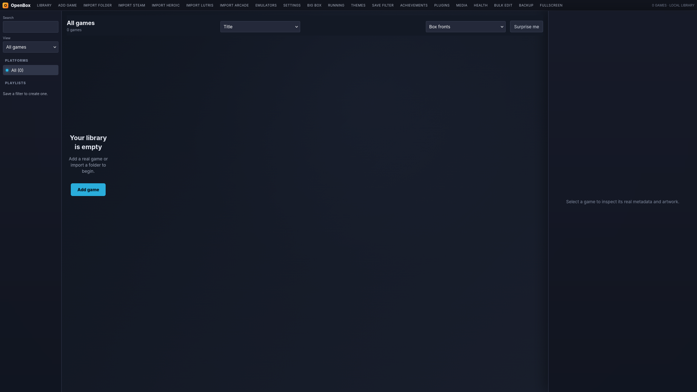

# OpenBox

<p align="center">
  
</p>

<h3 align="center">A local-first Linux game library and launcher — the open-source LaunchBox alternative</h3>

<p align="center">
  <a href="https://github.com/vindeckyy/OpenBox"></a>
  <a href="https://www.python.org/downloads/"></a>
  <a href="https://github.com/vindeckyy/OpenBox"></a>
</p>

<p align="center">
  Browse, organize, enrich, and launch your entire game collection — native Linux games,<br>
  ROMs, emulators, Steam, Epic, GOG, and everything in between.
</p>

---

## Table of Contents

- [About](#about)
- [Features](#features)
- [Screenshots](#screenshots)
- [Quick Start](#quick-start)
- [Usage](#usage)
- [Architecture](#architecture)
- [Emulator Profiles](#emulator-profiles)
- [Plugin API](#plugin-api)
- [LaunchBox Parity](#launchbox-parity)
- [Contributing](#contributing)
- [License](#license)

---

## About

**OpenBox** is a powerful, local-first game library manager and launcher for Linux. It brings together your entire gaming ecosystem — from native Linux titles and retro ROMs to games from Steam, Epic, GOG, and more — into one unified, beautifully organized interface.

Whether you're a retro enthusiast, a modern gamer, or someone who just wants complete control over their game library without cloud dependency, OpenBox provides the tools you need.

---

## Features

### 🎮 Library Management

- **Unified library** for native Linux games, ROMs, DOSBox, and emulator titles
- **Advanced search** across metadata, platform, genre, collection, developer, and series
- **Smart views**: Favorites, recently played, never played, and missing file detection
- **Rich metadata**: Editable descriptions, ratings, and progress tracking per game
- **Play tracking**: Automatic play counts, total playtime, and 500-session history
- **Custom collections** and smart filters with saveable presets
- **Bulk editing** across multiple games simultaneously
- **"Surprise Me"** random picker from your visible library

### 📥 Import & Discovery

- **Steam** — Import installed games with metadata, artwork, and launch integration
- **Epic, GOG, Amazon** — Import through Heroic Games Launcher
- **EA, Ubisoft, Xbox** — Import through Lutris
- **MAME & FinalBurn** — DAT/XML-aware full-set imports with merged, split, and non-merged classification
- **Recursive folder import** with automatic ROM platform detection by file extension
- **Watch folders** with automatic background scanning

### 🖼️ LaunchBox Database Integration

- Official **LaunchBox Games Database** daily sync
- Local matching with selective metadata and media downloads
- Cover art, backgrounds, and gameplay screenshots from the database
- Image-group browsing and bulk media downloads for matched libraries

### 🕹️ Emulator Support

- **Automatic emulator discovery** — Detects installed emulators on PATH
- **One-click Flatpak install** for major emulators (Dolphin, PPSSPP, PCSX2, RPCS3, Cemu, MAME, xemu)
- Per-platform emulator profiles with per-game command overrides
- Safe tokenized commands — spaces in paths handled correctly

### 🏆 RetroAchievements

- Full account integration with progress tracking and badge display
- Documented ROM hashing for automatic game matching
- Per-game achievement progress with hardcore status
- Common platform auto-matching (NES, SNES, GB, GBA, Genesis, N64, and more)

### 💾 Sessions & Save Management

- **Session tracking** with startup and shutdown screens that follow the launched process
- **Game control**: Pause, resume, stop, and restart running games from the UI
- **Automatic save-location discovery** for Steam Cloud, RetroArch, PCSX2, PPSSPP, RPCS3, Dolphin, and Cemu
- **Versioned save backups** with file and directory support
- **Safe restore** with automatic pre-restore safety copy

### 🔌 Plugin System

- Local plugin install, update, disable, and recoverable removal
- Isolated library, before_launch, and after_session hooks
- Sandboxed plugin runner with timeout protection

### 🎨 Themes & Big Box Mode

- **CSS themes** that import, persist, and apply live
- Per-platform theme mapping
- **Big Box mode**: Controller-first fullscreen navigation with keyboard and gamepad support
- Filter-aware browsing, paging, favorites, and launch

### ☁️ Cloud Sync & Backups

- **Cloud sync** through any mounted folder (Dropbox, Google Drive, Syncthing, etc.)
- **JSON backup and restore** with automatic pre-restore safety copy
- **Library audit** with provider-aware duplicate cleanup and missing-file checks

### 📦 Packaging & Updates

- **Portable AppImage** with bundled Python, desktop metadata, icon, and zsync auto-update
- Flatpak manifest for sandboxed distribution
- Makefile for standard system install/uninstall
- Desktop integration with icon, categories, and AppStream metainfo
- In-app update checker with SHA-256 verified GitHub release downloads

---

## Screenshots

<p align="center">
  
</p>

---

## Quick Start

### AppImage (Recommended)

```bash
chmod +x OpenBox-x86_64.AppImage
./OpenBox-x86_64.AppImage
```

The browser UI opens automatically. Pass `--native` for the compact Tk interface.

### System Install

```bash
sudo make install
openbox              # browser UI
openbox-native       # Tk interface
```

### Flatpak

```bash
flatpak-builder --user --install --force-clean build-dir io.openbox.GameLauncher.yml
flatpak run io.openbox.GameLauncher
```

### Run from Source

```bash
python3 web_app.py    # browser UI
python3 openbox.py    # Tk interface
```

---

## Usage

```bash
# Launch the application
./OpenBox-x86_64.AppImage                  # Browser UI
./OpenBox-x86_64.AppImage --native        # Tk interface

# Run smoke tests
./OpenBox-x86_64.AppImage --self-test     # Verify core functionality
python3 openbox.py --self-test            

# Run the full test suite
python3 test_emulators.py
python3 test_updates.py
python3 test_arcade.py
python3 test_archives.py
python3 test_importers.py
python3 test_metadata.py
python3 test_plugins.py
python3 test_retroachievements.py
python3 test_saves.py
python3 test_sessions.py
python3 test_packaging.py
```

---

## Architecture

```
openbox.py              → Tk native interface (compact, fast)
web_app.py              → Browser UI with REST API
├── importers.py        → Steam, Heroic, Lutris imports
├── arcade.py           → MAME/FinalBurn DAT-aware import
├── metadata.py         → LaunchBox Games Database sync + media
├── emulators.py        → Flatpak install + profile discovery
├── retroachievements.py→ Account, hashing, matching, progress
├── saves.py            → Save backup/restore for 6+ platforms
├── plugins.py          → Plugin install/update/hooks API
├── plugin_runner.py    → Sandboxed plugin subprocess runner
├── catalog.py          → Related games, bulk edits
├── archives.py         → ZIP/7z/RAR safe extraction
├── cloud_sync.py       → Mounted-folder stat syncing
└── updates.py          → GitHub release AppImage updates
```

**Data Location:** `~/.local/share/openbox-game-launcher/library.json`

---

## Emulator Profiles

Configure emulator profiles with a line like:

```ini
SNES = retroarch -L /path/to/snes9x_libretro.so {path}
```

Use `{path}` where the ROM should go. Other available tokens:
- `{name}` — Game name
- `{app_id}` — Steam App ID
- `{heroic_app_id}` — Heroic App ID
- `{lutris_id}` — Lutris ID
- `{rom_name}` — ROM filename

**Supported Platforms:** NES, SNES, Game Boy, GBA, N64, GameCube, Wii, PlayStation, PS2, PS3, PSP, Wii U, Xbox, Arcade, DOSBox, and more.

---

## Plugin API

Plugins are directories containing `plugin.json` and a Python entry file:

```json
{
  "id": "my-plugin",
  "name": "My Plugin",
  "version": "1.0.0",
  "entry": "plugin.py",
  "hooks": ["library", "before_launch", "after_session"]
}
```

Each hook receives and returns one JSON-compatible dictionary, allowing you to extend OpenBox functionality at key points in the game lifecycle.

---

## LaunchBox Parity

OpenBox aims to provide feature parity with LaunchBox on Linux. See [PARITY.md](PARITY.md) for a detailed comparison matrix showing which features are fully implemented (`done`) and which are partially implemented (`partial`).

Key capabilities include:
- ✅ Local library management with full metadata editing
- ✅ Steam, Epic, GOG, and Heroic integration
- ✅ MAME/FinalBurn DAT-aware imports
- ✅ LaunchBox Games Database synchronization
- ✅ Emulator installation and configuration
- ✅ Save management with automatic discovery
- ✅ RetroAchievements integration
- ✅ Big Box controller-first mode
- ✅ Theme support and customization
- ✅ Plugin system for extensibility
- ✅ Backup, restore, and cloud sync

---

## Contributing

Contributions are welcome! Here's how you can help:

1. **Report bugs** — Open an issue with steps to reproduce
2. **Request features** — Share your ideas for new functionality
3. **Submit PRs** — Fork the repo and submit pull requests
4. **Improve documentation** — Help make this README clearer
5. **Test builds** — Try out new releases and report issues

### Development Setup

```bash
# Clone the repository
git clone https://github.com/vindeckyy/OpenBox.git
cd OpenBox

# Run tests
python3 test_*.py

# Build AppImage
./build_appimage.sh
```

---

## License

OpenBox is licensed under the [GNU Affero General Public License v3.0](LICENSE).

---

<p align="center">
  <strong>Built for Linux gamers who want control over their library without cloud dependency.</strong>
</p>

<p align="center">
  Made with ❤️ for the open-source community
</p>
